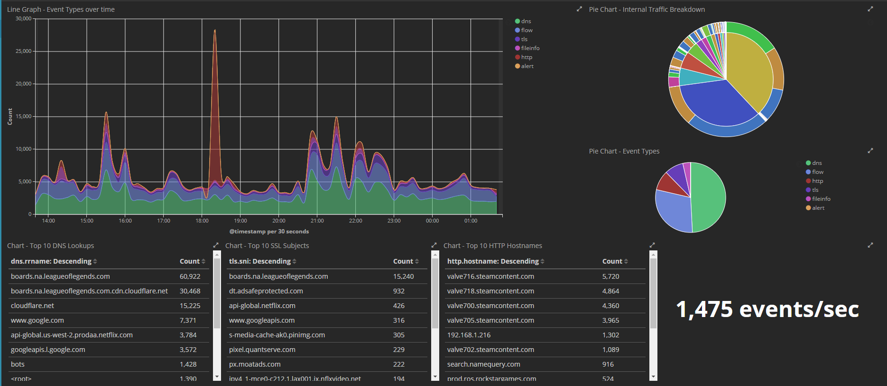
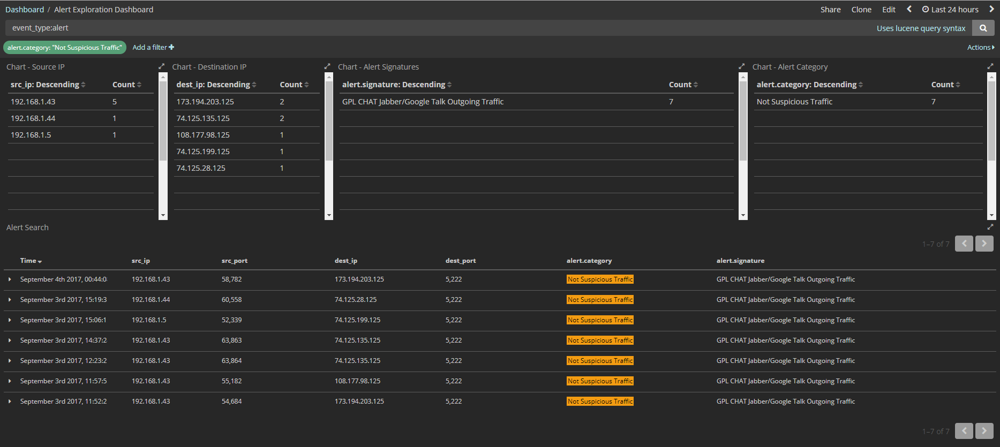

# grIDS
My network monitoring solution and tools that go along with it. This setup is designed to be contained in an all-in-one sort of system, but services can be separated into individual hosts if you have a higher load that requires more resources.

The goal for this project is to help people combine multiple open-source tools to have a useful network monitoring solution. Within this project, I'll also include custom scripts that help make this system even more useful.

Feedback, corrections, and suggestions are welcomed and appreciated. Reach out to me on [Twitter](https://www.twitter.com/0xgradius) or here on Github as an [Issue](https://github.com/gradiuscypher/grIDS/issues).

# Configuration Steps

[Setup Documentation](docs/setup.md)

To get started with configuring the system, follow the steps found in [setup.md](docs/setup.md). Each of the sections walks you through the parts of building a working all-in-one IDS system.

# Screenshots
Screenshots of some Kibana Dashboards that have been created and powered using this setup

# Future Additions + Modifications + Ideas
This is a list of future tools that could be added to this toolset for even more features. Also includes modifications.

#### Features
* Sysmon logging
* Bro logging
* Centralized Logging
* Webhook integration for alerts
* FPC and usability tools
* Pi-Hole DNS service
* Include [EveBox](https://evebox.org/) for alerting

#### Modifications
* Performance tuning for Elastic Stack
* Performance tuning of Suricata - spread load between CPU threads

#### Ideas
* IDS Sensor on a Raspberry Pi
* Spreading services out among hosts, multiple sensor configuration and management
* Setting up an iptables sensor
* Setting up a hardware network tap
* Process for upgrading/updating the OS
