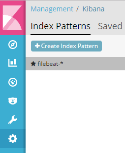
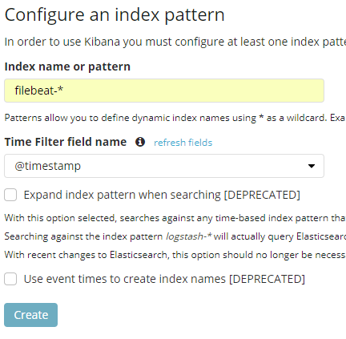
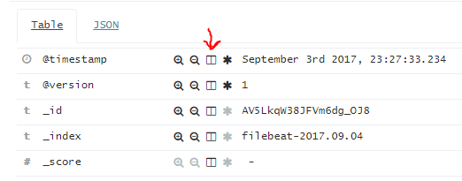
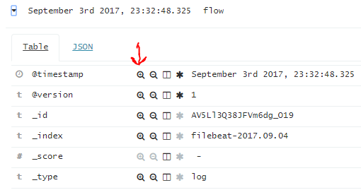
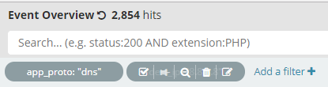
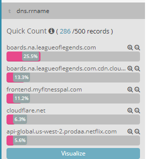
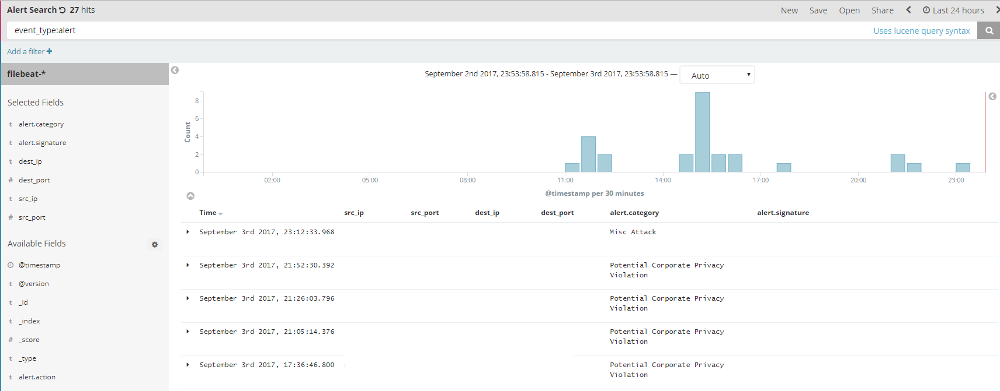

# Kibana
Kibana is the visualization tool that we'll be using to create dashboards and saved searches to navigate our data. Kibana uses [Lucene](https://www.elastic.co/guide/en/kibana/current/search.html) queries to search the data stored in Elasticsearch.

## Kibana Setup

### Accessing Kibana
To access Kibana, log into the IDS server on port 5601 in your browser:

`http://IDS_SERVER_IP:5601`

### Create Index Pattern
On the left-hand side of Kibana, click the "gear" icon. Then click "Create Index Pattern"

For the section "Index name or pattern" enter: `filebeat-*`. This allows us to visualize all the information saved in the `filebeat` indexes, separated by date. Leave the "Time Filter field name" as `@timestamp`

### Kibana Overview
Kibana has its functionality split into various pieces: Discover, Visualize, Dashboard, Timelion, Dev Tools, and Management.

#### Discover
Explore the data with searches. Each log entry is a row. By default no columns are selected, but can be selected by clicking "Toggle column in table"

Data can be quick filtered out with the magnifying glasses with plus and minus. Quick filters appear as bubbles near the top left next to the search bar. They can be enabled, disabled, deleted, and pinned. Pinned filters will follow you across Discover, Visualization, Dashboard, etc.

Along with data in the center, you can also show a quick count of the top five values of each field, on the left side. For fields with more than 5 values, you can also click "visualize" to get a bar graph of the top 20 values. Just click the field name on the left to expand it.

#### Visualization
Visualizations allow you to put data into various different graphs. You can create visualizations by clicking "+" in on the Visualizations tab.

From there, you can select the type of chart. Formats include Area, Heat Map, Horizontal Bar, Line, Pie, etc. The best way to understand how visualizations format data is to click around and use them.

#### Dashboard
Dashboards are just combinations of both saved Discovery searches and Visualizations. Dashboards let you drag these pieces around and resize as needed.

## Example Search
All fields in Elasticsearch can be filtered/searched on. For this example, we'll be displaying all of the IDS alerts Suricata.

#### Lucene Query
For the Lucene query, we'll be using `event_type:alert`. This allows us to only see our IDS alerts.

#### Field Columns
As mentioned in the overview, you can click the columns button on each relevant field to show them in the Discover screen. Afterwards, you'll end up with something like this:

#### JSON Export of Example Search
The exported JSON can be found [here](../kibana_exports/alert_search.json). For more information on how to use this JSON, check out [this section](#importing-exported-json)

## Example Visualization
TODO

## Example Dashboard
TODO

## Importing Exported JSON
TODO

## Saved Searches
TODO

## Saved Visualizations
TODO

## Saved Dashboards
TODO
